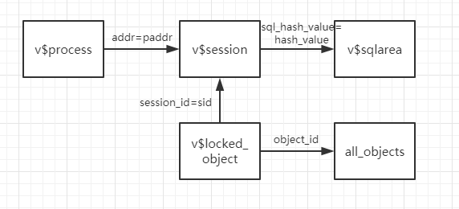

闲暇之余,写点Oracle的笔记;分为基础和进阶两部分,基础部分写点日常常见的函数使用,进阶部分写点与业务有关的以及排查问题的方式

<!--more-->

## 一,Oracle基础知识

1.Oracle trunc函数，获取日期以及截取精度使用；

```sql
select trunc(sysdate,'yy') from dual ；当前年的第一天=2017/1/1
select trunc(sysdate,'mm') from dual ；当前月的第一天=2017/12/1
--dd,hh,mi...day，hour，miao
select trunc(123.458,1) from dual --123.4；不进行四舍五入，只保留几位；
select trunc(123.458,-1) from dual --120
```

2.NVL函数的格式如下：NVL(expr1,expr2),判空表达式

如果oracle第一个参数为空那么显示第二个参数的值，如果第一个参数的值不为空，则显示第一个参数本来的值。

3.ROUND() 函数用于把数值字段**四舍五入**为指定的小数位数

```sql
select round(12.345,2) from dual;12.35
select round(12.344,2) from dual;12.34
select round(12.3,2) from dual;12.3
```

4.保留精度,有时候就想让查询保留若干为小数

```sql
select to_char('12.345','00.00') from dual;12.34
select to_char('12.3','00.00') from dual;12.30
```

5.rank函数,通常用于按照某个特定的条件来排序,特定条件相同的,rank值相同;

```sql
select rank() over(order by field) as rank from table;
```

结果类似于

| field | rank |
| ----- | ---- |
| a     | 1    |
| a     | 1    |
| b     | 3    |

6.dense_rank函数,与rank函数相似,只不过rank值他是连续的

```sql
select dense_rank() over(order by field) as rank from table;
```

结果类似于

| field | rank |
| ----- | ---- |
| a     | 1    |
| a     | 1    |
| b     | 2    |

## 二,Oracle进阶知识

1.Oracle递归查询,数据之间有父子依赖关系,比如字段中有id,parentId字段,现在想看id=1的所有子节点;

SELECT ... FROM    + 表名  START WITH +条件1CONNECT BY PRIOR +条件2WHERE  +条件3

条件1：是根节点的限定语句，当然可以放宽限定条件，以取得多个根节点，也就是多棵树；

条件2：是连接条件，其中用PRIOR表示上一条记录，例如CONNECT BY PRIOR id= pid,连接条件为,id是别人的父id的值

条件3：是过滤条件，用于对返回的记录进行过滤。

```sql
select t.*,level from treeList t start with id=1 connect by prior id = pid;//查找id为1,并且id是别人的pid(父id)的子节点,即查看id为1的所有子节点元素,以及他们所在层级
select t.*,level from treeList t start with id=8 connect by prior pid = id;//查找id为8,并且pid(父id)是别人id的节点,即查看id为8的所有父级元素,以及他们所在层级

select * from treeList t where not exists(select * from treeList l where l.pid = t.id);//从里面开始看,l.pid = t.id;t是外层的,从t开始解读,id是别人的pid,即子节点,not exists,所以这个sql查询的是不存在子节点的元素

select * from treeList t where not exists(select * from treeList l where l.id = t.pid);//l.id=t.pid,父id是别人的id,即查父节点,not exists,所以这个sql查的是不存在父节点的元素
```

2.查看列名在哪些表中存在,区分大小写;

```sql
select table_name from user_tab_columns where column_name="###"
```

3.查询Oracle正在执行的sql语句及执行该语句的用户;

```sql
select  b.sid oracleID, b.username 登录用户名,  

        b.machine 计算机名, c.sql_text 正在执行的SQL,  
from v$process a, v$session b, v$sqlarea c
where a.addr = b.paddr and b.sql_hash_value = c.hash_value
```

4.查看正在执行sql的发起者的执行程序;

```sql
select  OSUSER 登录身份, PROGRAM 发起请求的程序,  

        USERNAME 登录Oracle用户名, B.Cpu_Time 花费cpu的时间,  
        STATUS, B.SQL_TEXT 执行的sql  
from v$session a left join v$sqlarea b
on a.sql_address = b.address
and a.sql_hash_value = b.hash_value
order by b.cpu_time desc;
```

5.查出oracle当前的被锁对象;

```sql
select a.session_id sid, c.serial#, a.locked_mode 锁模式,  

    a.oracle_username 登录用户, a.os_user_name 登录机器用户名,  

    c.machine 机器名, c.terminal 终端用户名,  

    b.object_name 被锁对象名, c.logon_time 登录数据库时间
from v$locked_object a,all_objects b, v$session c
where a.object_id = b.object_id and a.session_id = c.sid
order by sid,c.serial#
```

6.kill掉当前的锁对象:  

```sql
alter system kill session 'sid,s.serial#';
```


